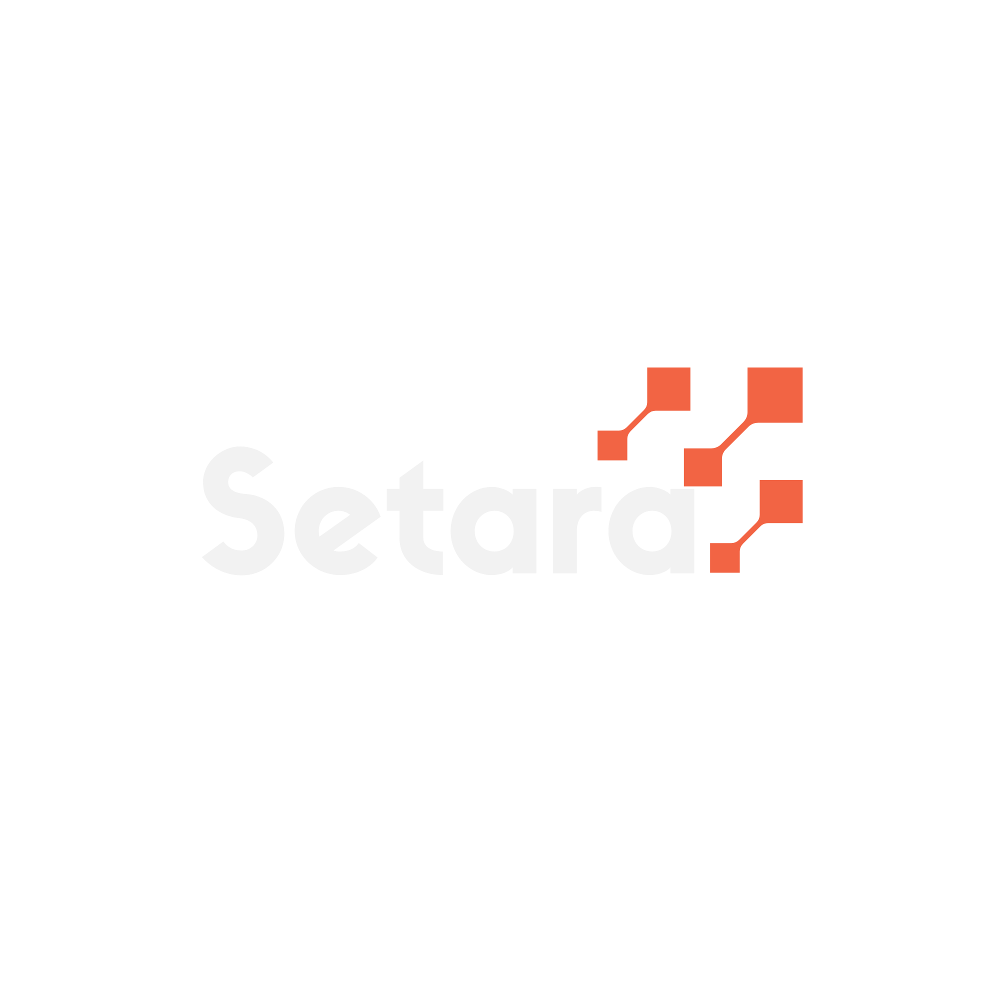

<p align="center">
  
</p>

<h3 align="center">India's Sovereign Document Blockchain</h3>

<p align="center">
  Secure, verify, and manage documents on a decentralized network built for organizations.<br/>
  Zero tokens. Zero complexity. Just trust.
</p>

<p align="center">
  <a href="https://setara.network">Website</a> &middot;
  <a href="documentation/whitepaper.md">Whitepaper</a> &middot;
  <a href="documentation/api.md">API Docs</a> &middot;
  <a href="documentation/run-node.md">Run a Node</a> &middot;
  <a href="https://explorer.setara.network">Explorer</a>
</p>

---

## What is Setara?

Setara is a purpose-built blockchain for document management, built on the Cosmos SDK. Organizations can register document hashes, link IPFS storage, and enable public verification — all without dealing with tokens or cryptocurrency.

**Key Features:**
- **No tokens** — Pay in fiat (INR) via a credit-based wallet system
- **Self-service** — Register, get 5,000 free credits, start building in minutes
- **Docker deployment** — One command to run a validator node + IPFS
- **Access controlled** — Only registered org admins can write documents
- **Public verification** — Anyone can verify a document's authenticity
- **IBC ready** — Future multi-chain expansion (EVM, NFT, Token chains)

## Architecture

```
┌─────────────────────────────────────────────────────┐
│                   Setara Network                     │
│                                                      │
│  ┌──────────┐  ┌──────────┐  ┌──────────┐          │
│  │ Org Node │  │ Org Node │  │ Org Node │  ...      │
│  │ setarad  │  │ setarad  │  │ setarad  │          │
│  │ + IPFS   │  │ + IPFS   │  │ + IPFS   │          │
│  └────┬─────┘  └────┬─────┘  └────┬─────┘          │
│       │              │              │                │
│       └──────────────┼──────────────┘                │
│                      │                               │
│              ┌───────┴───────┐                       │
│              │  Setara API   │                       │
│              │  (Billing +   │                       │
│              │   Wallet)     │                       │
│              └───────┬───────┘                       │
│                      │                               │
│         ┌────────────┼────────────┐                  │
│         │            │            │                  │
│    ┌────┴────┐ ┌─────┴────┐ ┌────┴─────┐           │
│    │Explorer │ │  Admin   │ │ Verify   │           │
│    │Ping.pub │ │  Panel   │ │ Portal   │           │
│    └─────────┘ └──────────┘ └──────────┘           │
└─────────────────────────────────────────────────────┘
```

**Setara hosts:** Seed nodes, API server, Explorer, Admin Panel, Website

**Organizations host:** Validator node + IPFS node (via Docker Compose)

## Quick Start

### 1. Register Your Organization

```bash
curl -X POST https://api.setara.network/api/v1/register \
  -H "Content-Type: application/json" \
  -d '{
    "name": "My Organization",
    "first_name": "John",
    "last_name": "Doe",
    "email": "john@myorg.com",
    "phone": "+91-9876543210"
  }'
```

You'll receive your `org_id`, `api_key`, and **5,000 free credits**.

### 2. Run a Validator Node

```bash
git clone https://github.com/setara-network/setara.git
cd setara/docker
cp .env.example .env    # Configure MONIKER, PEERS
docker compose up -d    # Starts setarad + IPFS
```

### 3. Register a Document

```bash
curl -X POST https://api.setara.network/api/v1/me/documents \
  -H "X-API-Key: sk_your_api_key" \
  -H "Content-Type: application/json" \
  -d '{
    "hash": "sha256:your_document_hash",
    "ipfs_cid": "QmYourIPFSCID",
    "doc_type": "certificate",
    "metadata": "{\"name\":\"Award Certificate\"}",
    "recipient": "recipient_id"
  }'
```

### 4. Verify a Document (Public)

```bash
curl https://api.setara.network/api/v1/verify?hash=sha256:your_document_hash
```

## Networks

| Network | Chain ID | Status |
|---------|----------|--------|
| Mainnet | `setara-1` | Coming soon |
| Testnet | `setara-testnet-1` | Active |

## Project Structure

```
setara/
├── cmd/setarad/            # Chain binary
├── x/document/             # Document module (register, verify, query)
├── x/organization/         # Organization module (register, access control)
├── api/                    # REST API (wallet, billing, org management)
├── docker/                 # Docker Compose deployment for orgs
├── explorer/               # Block explorer (Ping.pub)
├── website/                # setara.network
├── admin/                  # Super admin panel
├── docs/                   # Whitepaper, API docs, guides
└── proto/                  # Protobuf definitions
```

## API

| Tier | Auth | Endpoint | Description |
|------|------|----------|-------------|
| Public | — | `POST /api/v1/register` | Register organization |
| Public | — | `GET /api/v1/verify?hash=` | Verify document |
| Org | `X-API-Key` | `GET /api/v1/me/wallet` | View credit balance |
| Org | `X-API-Key` | `GET /api/v1/me/transactions` | Transaction history |
| Org | `X-API-Key` | `POST /api/v1/me/documents` | Register document (costs credits) |
| Admin | `X-Admin-Secret` | `GET /api/v1/admin/orgs` | List organizations |
| Admin | `X-Admin-Secret` | `POST /api/v1/admin/wallets/{id}/credit` | Add/deduct credits |
| Admin | `X-Admin-Secret` | `PATCH /api/v1/admin/billing/{id}` | Update pricing |

## Billing

- **1 credit = 1 INR** (configurable per organization)
- **1 credit per document** by default (configurable)
- **5,000 free credits** on signup
- Node fees: Free during testnet, paid on mainnet
- Only super admin can manage wallets

## Built With

- [Cosmos SDK](https://cosmos.network) — Blockchain framework
- [CometBFT](https://cometbft.com) — Byzantine fault-tolerant consensus
- [IPFS](https://ipfs.io) — Decentralized storage
- [Ping.pub](https://ping.pub) — Block explorer

## Contributing

Setara is open source. Contributions are welcome.

1. Fork the repository
2. Create your feature branch (`git checkout -b feature/my-feature`)
3. Commit your changes
4. Push and open a Pull Request

## License

[Apache 2.0](LICENSE)

---

<p align="center">
  <strong>Built with pride in India</strong>
  <br/>
  <a href="https://setara.network">setara.network</a>
</p>
